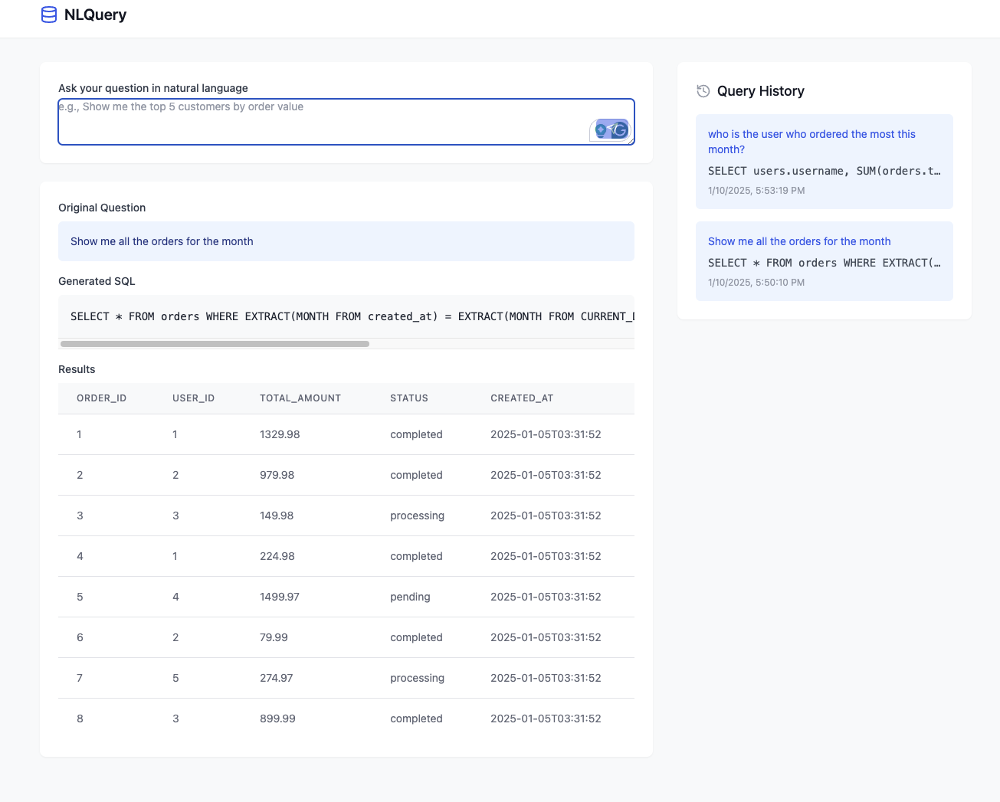
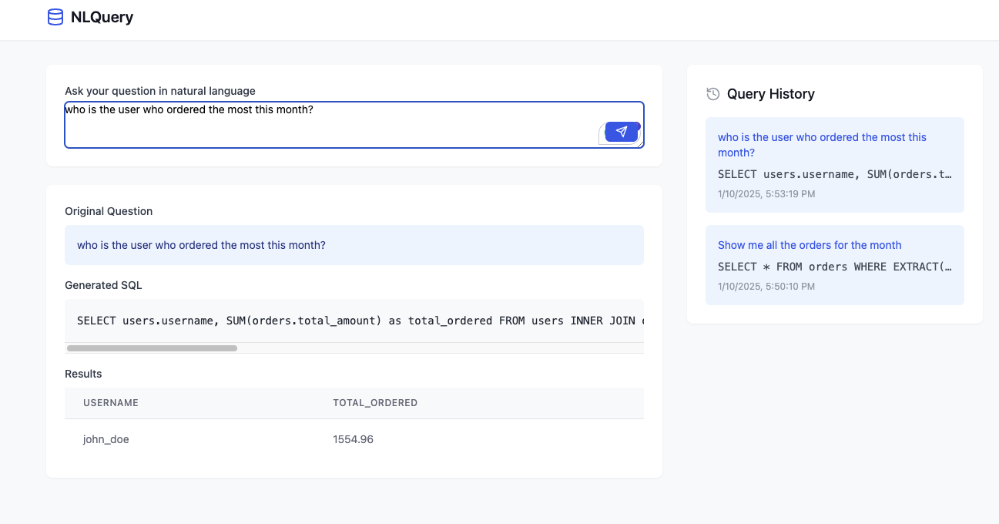

# NLQuery

NLQuery is an AI-powered tool that translates natural language into SQL queries, making database interactions more intuitive and accessible.




## Features

- Natural language to SQL query conversion
- Support for multiple database types (PostgreSQL, MySQL)
- AI-powered query generation using Claude or OpenAI
- Interactive chat interface
- Real-time query results display
- Pagination for large result sets
- Configurable database and AI settings

## Prerequisites

- Docker and Docker Compose
- Database server (PostgreSQL or MySQL)
- AI API key (Claude or OpenAI)

## Getting Started

1. Clone the repository:
```bash
git clone https://github.com/yourusername/nlquery.git
cd nlquery
```

2. Create a `.env` file from the example:
```bash
cp .env.example .env
```

3. Edit the `.env` file with your database and AI configuration.

4. Build and start the containers:
```bash
docker-compose up --build
```

5. Access the application:
- Frontend: http://localhost:3000
- Backend API: http://localhost:8000

## Configuration

### AI Settings
- Provider: Choose between Claude or OpenAI
- API Key: Your AI provider API key
- Model: Specific model to use (e.g., claude-3-opus-20240229 or gpt-4)
- Temperature: AI response randomness (0-1)
- Max Tokens: Maximum response length

## Development Setup

### Backend
1. Create a virtual environment:
```bash
cd backend
python -m venv venv
source venv/bin/activate  # On Windows: .\venv\Scripts\activate
```

2. Install dependencies:
```bash
pip install -r requirements.txt
```

3. Run the development server:
```bash
export $(cat ../.env | xargs)
uvicorn app.main:app --reload
```

### Frontend
1. Install dependencies:
```bash
cd frontend-old
npm install
```

2. Run the development server:
```bash
npm run dev
```

## Project Structure

```
sql-chat/
├── backend/
│   ├── app/
│   │   ├── __init__.py
│   │   ├── main.py
│   │   ├── core/
│   │   │   ├── __init__.py
│   │   │   ├── config.py
│   │   │   └── security.py
│   │   ├── api/
│   │   │   ├── __init__.py
│   │   │   └── routes.py
│   │   └── models/
│   │       ├── __init__.py
│   │       └── schemas.py
│   ├── requirements.txt
│   └── Dockerfile
├── frontend/
│   ├── src/
│   │   ├── components/
│   │   │   ├── Chat.jsx
│   │   │   ├── ConfigForm.jsx
│   │   │   └── QueryResults.jsx
│   │   ├── App.jsx
│   │   └── main.jsx
│   ├── package.json
│   └── Dockerfile
├── docker-compose.yml
└── README.md
```

## API Documentation

### Endpoints

#### POST /api/v1/chat
Send a natural language query to the system.

Request:
```json
{
  "message": "Show me all orders from last month",
  "conversation_id": "optional-conversation-id"
}
```

Response:
```json
{
  "message": "Query results...",
  "sql": "SELECT * FROM...",
  "results": [
    {
      "column1": "value1",
      "column2": "value2"
    }
  ]
}
```

#### POST /api/v1/conversations
Create a new conversation.

Response:
```json
{
  "conversation_id": "uuid"
}
```

#### GET /api/v1/conversations/{conversation_id}
Get conversation history.

Response:
```json
{
  "messages": [
    {
      "role": "user",
      "content": "message"
    },
    {
      "role": "assistant",
      "content": "response"
    }
  ]
}
```

## Security Considerations

- All database credentials and API keys should be stored securely
- Use environment variables for sensitive information
- Enable SSL for database connections in production
- Implement proper authentication and authorization
- Regularly update dependencies for security patches

## Contributing

1. Fork the repository
2. Create a feature branch
3. Commit your changes
4. Push to the branch
5. Create a Pull Request

## License

This project is licensed under the MIT License - see the LICENSE file for details.
 Database Settings
- Type: PostgreSQL or MySQL
- Host: Database server hostname
- Port: Database server port
- Database: Database name
- Username: Database user
- Password: Database password
- SSL: Enable/disable SSL connection

###